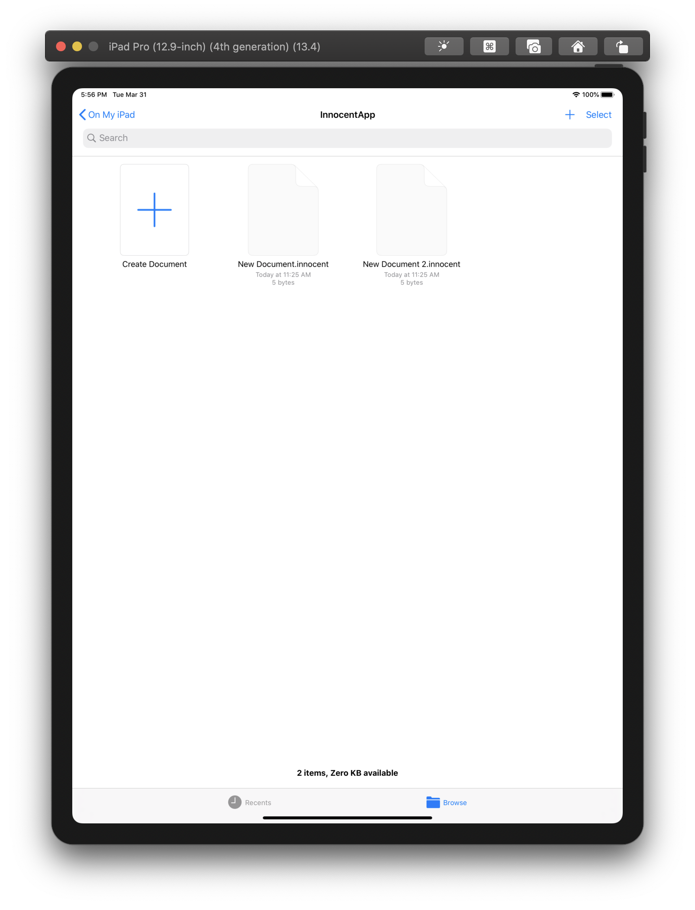
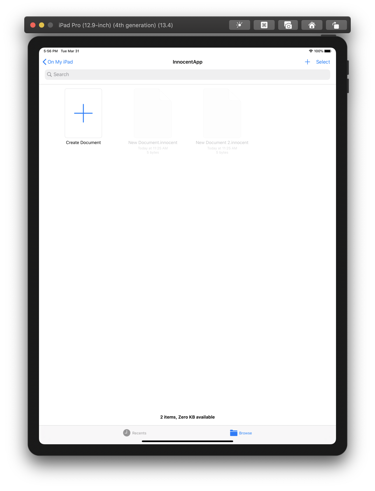

# Overview

This repository demonstrates how the [UIDocumentBrowserViewController](https://developer.apple.com/documentation/uikit/uidocumentbrowserviewcontroller) component is *broken* by a [race condition](https://en.wikipedia.org/wiki/Race_condition) issue caused by multiple iOS apps trying to register different [Uniform Type Identifiers](https://developer.apple.com/library/archive/documentation/FileManagement/Conceptual/understanding_utis/understand_utis_conc/understand_utis_conc.html) (aka. *UTI*) against the same [filename extension](https://en.wikipedia.org/wiki/Filename_extension).

This issue affects ALL iOS apps that adpot `UIDocumentBrowserViewController` since iOS 11 and, when it happens, the **whole app is malfunctioning** since the document browser, i.e. the root view controller of the app, is broken. It must be fixed, and can only be fixed, by Apple.

# Steps to Reproduce

1.  Clone this repository.
2.  Open the "InnocentApp" project (a minimal Document-based App) using Xcode, select a testing device (either a simulator or a real device, iPad recommended), build and run the app.

    

3.  When the "InnocentApp" is launched, tap the "+" button to create a few empty documents, e.g. `New Document.innocent`.

    

4.  Try tapping these files, and make sure that they can be opened in a simple document view.

    

5.  Return to Xcode, and open the "MalicousApp" project, build and run it on the same device chosen above.

    

6.  When the "MaliciousApp" is installed and launched, you don't even need to perform any interaction with this app, just simply return to the Home Screen and re-open the "InnocentApp" (or you can do so using the App Switcher).
7.  Here the *"MAGIC"* happens: **All `.innocent` documents created by the "InnocentApp" can NOT be opened any more inside the very same app!** You can NOT even rename or delete them! And the most weird thing is that *you CAN still create new `.innocent` documents, but you can NO LONGER re-open them*! Now the app becomes *totally useless* since `UIDocumentBrowserViewController` can't open any documents.

    

8.  Now return to the Home Screen, delete the "MaliciousApp", and return to the "InnocentApp". You should be able to open/edit/rename/delete those documents again.

# What's Wrong?

The "InnocentApp" declares an "Exported UTI" named `me.frankshaka.file.innocent` and associate it with the filename extension `innocent`, according to [this developer guide about Declaring New UTIs](https://developer.apple.com/library/archive/documentation/FileManagement/Conceptual/understanding_utis/understand_utis_declare/understand_utis_declare.html).

The "MaliciousApp" also declares an "Exported UTI" to be associated with this filename extension, but using a different identifier `me.frankshaka.file.malicious`.

When an app is installed (or updated), the operating system reads the app's UTI declarations and automatically registers them in the [File Metadata](https://developer.apple.com/documentation/coreservices/file_metadata) Core Service. This behavior is the same on both iOS and macOS.

Obviously, one kind of filename extensions can only be associated with one UTI across the system. So, when the "MalicousApp" is installed, all `.innocent` files across the system will hence be regarded as documents of type `me.frankshaka.file.malicious`.

What's actually wrong is that `UIDocumentBrowserViewController` *thinks* that the "InnocentApp" is not permitted to open `.innocent` files just because the app is not associated with the malicious UTI. This does NOT make sense. The document browser is just a normal component of the app from the users' points of view, rather than a system widget like the Share Sheet or a Document Picker, and thus it should behave the same way and obey the same rules as other components inside this app, no matter how it works.

This issue is *disgusting* because, as the developer of the "InnocentApp", you've done nothing wrong. You precisely follow the Apple's documentation and tutorials, and even created the app from the Xcode template "Document-based App". And one day, you suddenly receive thousands of emails from angry users, or even thousands of 1-star comments to your app in the App Store, reporting that your app does not work any more, just because they installed another app developed by a third-party developer!

Sure you can ask your users to delete that third-party app. But in a real world, *big companies can make small mistakes*. That third-party app could happen to be Twitter, Facebook, Youtube, Instagram, Dropbox, Spotify, or even a popular game. It doesn't have to be a "Document-based App", all it needs is to *carelessly* include several lines of code in their `Info.plist` file and submit the update to the App Store, and ... "Boooom!" You're done.

# What You Can Do

If you've also encountered this issue, there's rarely anything you can do to quickly recover from the consequence. Here're my suggestions.

1.  Ask the third-party developer to update their app by either removing that UTI declaration or use the same declaration as yours. (If you can't contact them directly, you can try [asking Apple to mediate between you and the third-party developer](https://www.apple.com/legal/internet-services/itunes/appstorenotices/).) And WAIT for the updated version of that app to be submitted, promoted, and finally downloaded and installed by all of your users affected.
2.  [Submit a bug report to Apple](https://feedbackassistant.apple.com/) and, again, WAIT for Apple to fix this bug.

If you're just interested in this issue, it's welcome for you to

1.  Star this repository or watch for updates;
2.  Leave comments in Issues, and share your thoughts on this.

# License

MIT
